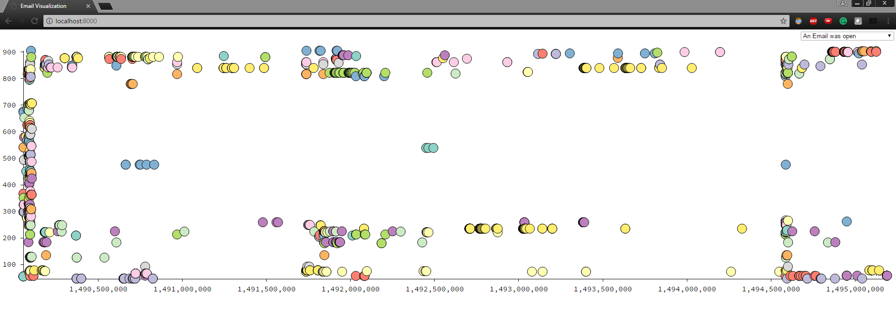
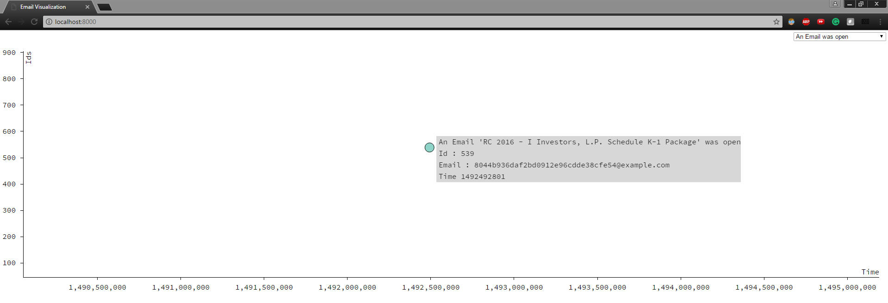

# mixpanel_viz

This is my solution for a coding challenge for a job interview in which I'm, as of the time of this writing, a candidate. I created a visualization using HTML/CSS/Javascript/d3. The data and instructions for this challenge can be found in the mixpanel directory.

## Displaying the visualization

### Option 1
You might be able to view this visualization on Firefox without setting up a localhost. Try opening the index.html file in Firefox and it might work.

### Option 2
If unable to view the index.html file in your browser, you'll have to set up a localhost. After cloning the code locally, the visualization can be viewed on your browser at `http://localhost:8000/`. Many text editors can set up a localhost, but as an alternative you can use node.js or Python as follows:

#### Node Server
```
cd mixpanel_viz
npm install -g http-server
http-server ./ -p 8000
```

#### Python Server
```
cd mixpanel_viz
python -m SimpleHTTPServer
```

## Screenshots

### Screenshot 1 - All the opened emails

After selecting 'An email was open in the dropdown':
<br>


### Screenshot 2 - All the opened emails - Details

After selecting 'An email was open in the dropdown' and mousing over a dot:
<br>

